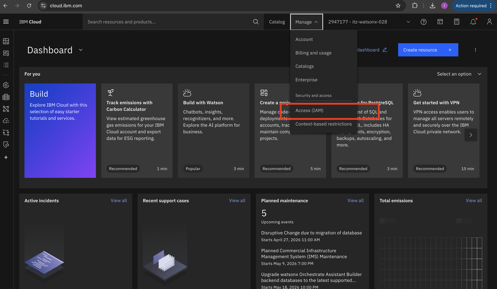
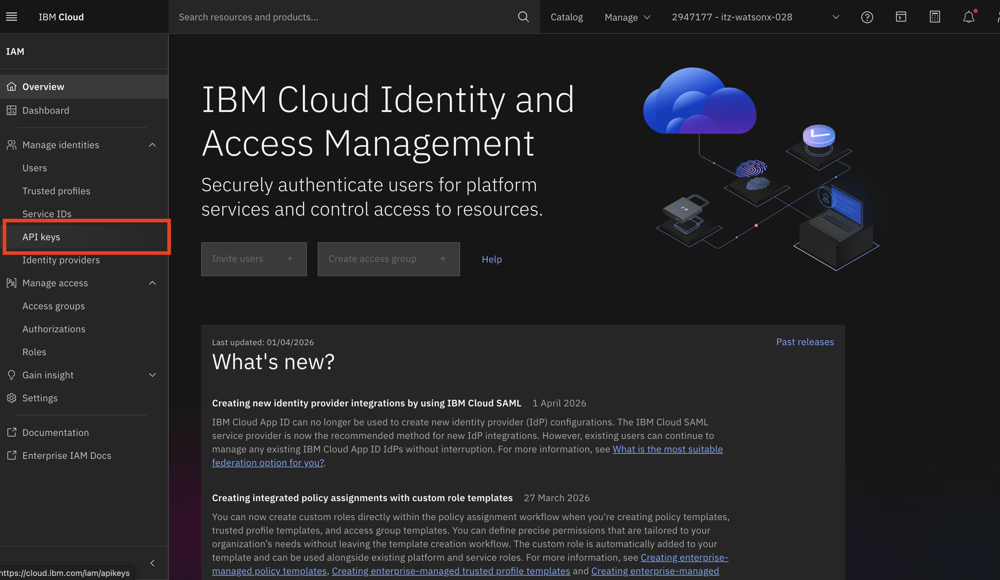
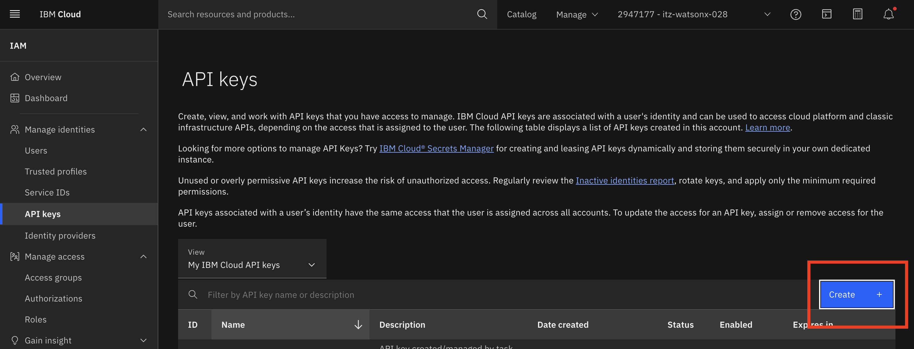
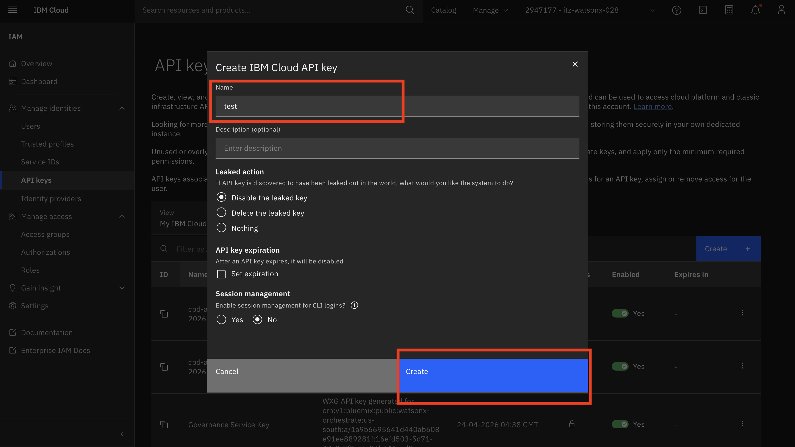
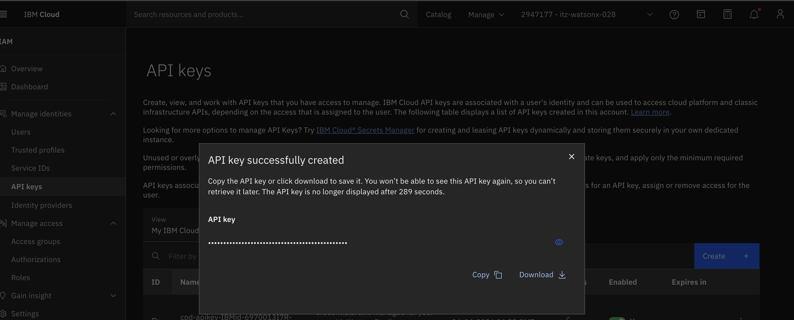
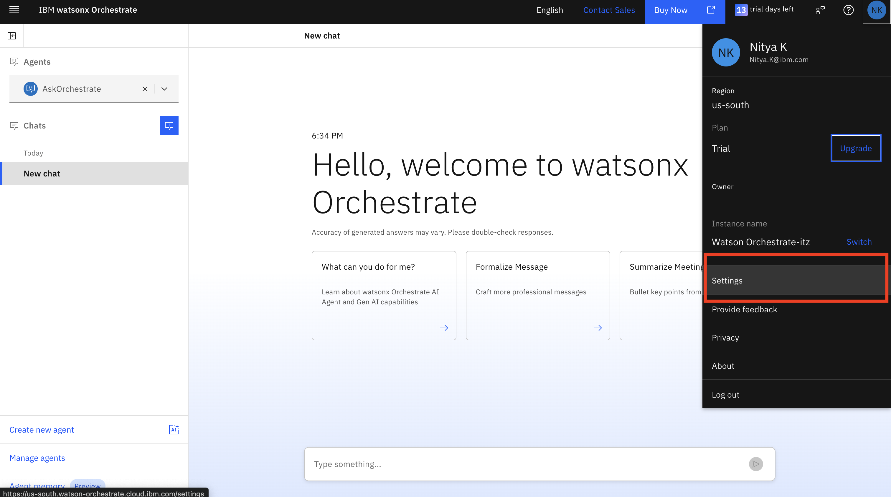
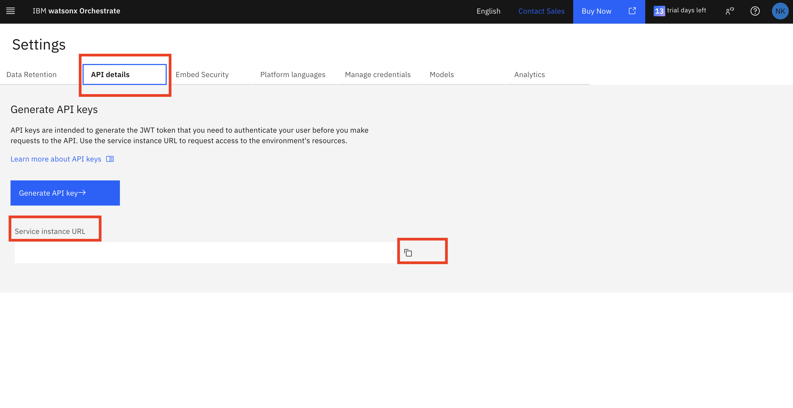
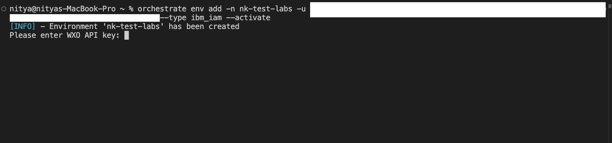

Uploading Tools
===============

Before starting Lab 3, open your terminal and create the files below exactly as provided. Before importing tools into Orchestrate we will be needing an API key and Service Instance URL.

Get Your API Key
================

First, get your API key from the dashboard.

1. Go to the dashboard and click **Manage**, then select **Access (IAM)**.

   

1. Select **API keys**.

   

1. Click **Create**.

   

1. Add a name, then click **Create**.

   

1. Copy or download the API key and store it in a safe place.

   

Get Your Service Instance
=========================

Next, get the service instance details.

1. Open your Watsonx Orchestrate page, click your profile initials (top-right), then select **Settings**.

   

1. Open the service instance and copy the required instance details for later use.

   

Activate Watsonx Orchestrate Environment
========================================

Now activate the Watsonx Orchestrate environment in your terminal using the service instance URL and API key.

Use this command (copy and paste):

```bash
orchestrate env add -n <environment-name> -u <service-instance-url>
```

1. In your terminal, run the command above with your environment name and service instance URL.

   

1. When prompted, paste your API key. Once accepted, the environment is created and ready to use.

   

Step-by-step instructions
=========================

1. Create a local folder for the tools.
1. Create the following files in that folder.
1. Copy and paste the code exactly as shown (do not modify anything).

1) `requirements.txt`

```txt
requests>=2.32.4
```

2) `search_healthcare_providers.py`

```python
from typing import List

import requests
from pydantic import BaseModel, Field
from enum import Enum

from ibm_watsonx_orchestrate.agent_builder.tools import tool, ToolPermission


class ContactInformation(BaseModel):
    phone: str
    email: str


class HealthcareSpeciality(str, Enum):
    GENERAL_MEDICINE = 'General Medicine'
    CARDIOLOGY = 'Cardiology'
    PEDIATRICS = 'Pediatrics'
    ORTHOPEDICS = 'Orthopedics'
    ENT = 'Ear, Nose and Throat'
    MULTI_SPECIALTY = 'Multi-specialty'


class HealthcareProvider(BaseModel):
    provider_id: str = Field(None, description="The unique identifier of the provider")
    name: str = Field(None, description="The providers name")
    provider_type: str = Field(None, description="Type of provider, (e.g. Hospital, Clinic, Individual Practitioner)")
    specialty: HealthcareSpeciality = Field(None, description="Medical speciality, if applicable")
    address: str = Field(None, description="The address of the provider")
    contact: ContactInformation = Field(None, description="The contact information of the provider")


@tool
def search_healthcare_providers(
        location: str,
        specialty: HealthcareSpeciality = HealthcareSpeciality.GENERAL_MEDICINE
) -> List[HealthcareProvider]:
    """
    Retrieve a list of the nearest healthcare providers based on location and optional specialty. Infer the
    speciality of the location from the request.


    :param location: Geographic location to search providers in (city, state, zip code, etc.)
    :param specialty: (Optional) Medical specialty to filter providers by (**Must be** one of: "ENT", "General Medicine", "Cardiology", "Pediatrics", "Orthopedics", "Multi-specialty")

    :returns: A list of healthcare providers near a particular location for a given speciality
    """
    resp = requests.get(
        'https://find-provider.1sqnxi8zv3dh.us-east.codeengine.appdomain.cloud',
        params={
            'location': location,
            'speciality': specialty
        }
    )
    resp.raise_for_status()
    return resp.json()['providers']
```

Import this tool into Orchestrate:

```bash
orchestrate tools import -k python -f search_healthcare_providers.py -r requirements.txt
```

3) `get_healthcare_benefits.py`

```python
from enum import Enum

from ibm_watsonx_orchestrate.agent_builder.tools import tool, ToolPermission
import requests

class Plan(str, Enum):
    HDHP = 'HDHP'
    HDHP_Plus = 'HDHP Plus'
    PPO = 'PPO'


@tool
def get_healthcare_benefits(plan: Plan, in_network: bool = None):
    """
    Retrieve a comprehensive list of health benefits data, organized by coverage type and plan variant.
    This data outlines details such as annual deductibles, out-of-pocket maximums, and various co-pays
    or percentages for medical services under different network plans (HDHP, HDHP Plus, and PPO).

    :param plan: Which plan the user is currently on, can be one of "HDHP", "HDHP Plus", or "PPO". If not provided all plans will be returned.
    :param in_network: Whether the user wants coverage for in network or out of network. If not provided both will be returned.
    :returns: A list of dictionaries, where each dictionary contains:
              - 'Coverage': A description of the coverage type (e.g., 'Preventive Services')
              - 'HDHP (In-Network)': The cost/percentage coverage for an in-network HDHP plan
              - 'HDHP (Out-of-Network)': The cost/percentage coverage for an out-of-network HDHP plan
              - 'HDHP Plus (In-Network)': The cost/percentage coverage for an in-network HDHP Plus plan
              - 'HDHP Plus (Out-of-Network)': The cost/percentage coverage for an out-of-network HDHP Plus plan
              - 'PPO (In-Network)': The cost/percentage coverage for an in-network PPO plan
              - 'PPO (Out-of-Network)': The cost/percentage coverage for an out-of-network PPO plan
    """
    resp = requests.get(
        'https://get-benefits-data.1sqnxi8zv3dh.us-east.codeengine.appdomain.cloud/',
        params={
            'plan': plan,
            'in_network': in_network
        }
    )
    resp.raise_for_status()
    return resp.json()['benefits']
```

Import this tool into Orchestrate:

```bash
orchestrate tools import -k python -f get_healthcare_benefits.py -r requirements.txt
```

4) `get_my_claims.py`

```python
from ibm_watsonx_orchestrate.agent_builder.tools import tool


@tool
def get_my_claims():
    """
    Retrieve detailed information about submitted claims including claim status, submission and processing dates,
    amounts claimed and approved, provider information, and services included in the claims.

    :returns: A list of dictionaries, each containing details about a specific claim:
              - 'claimId': Unique identifier for the claim
              - 'submittedDate': Date when the claim was submitted
              - 'claimStatus': Current status of the claim (e.g., 'Processed', 'Pending', 'Rejected')
              - 'processedDate': Date when the claim was processed (null if not processed yet)
              - 'amountClaimed': Total amount claimed
              - 'amountApproved': Amount approved for reimbursement (null if pending, 0 if rejected)
              - 'rejectionReason': Reason for rejection if applicable (only present if claimStatus is 'Rejected')
              - 'provider': Provider details, either as a simple string or a dictionary with detailed provider information
              - 'services': List of services included in the claim, each with:
                  - 'serviceId': Identifier for the service
                  - 'description': Description of the service provided
                  - 'dateOfService': Date the service was provided
                  - 'amount': Amount charged for the service
    """
    claims_data = [
        {
            "claimId": "CLM1234567",
            "claimStatus": "Processed",
            "amountClaimed": 150.00,
            "amountApproved": 120.00,
            "provider": {
                "name": "Healthcare Clinic ABC",
                "providerId": "PRV001234",
                "providerType": "Clinic"
            },
            "services": [
                {"serviceId": "SVC001", "description": "General Consultation", "dateOfService": "2025-02-28", "amount": 100.00},
                {"serviceId": "SVC002", "description": "Blood Test", "dateOfService": "2025-02-28", "amount": 50.00}
            ]
        },
        {
            "claimId": "CLM7654321",
            "claimStatus": "Pending",
            "amountClaimed": 300.00,
            "amountApproved": None,
            "provider": "City Health Hospital",
            "services": [
                {"serviceId": "SVC003", "description": "X-ray Imaging", "dateOfService": "2025-02-14", "amount": 300.00}
            ]
        },
        {
            "claimId": "CLM9876543",
            "claimStatus": "Rejected",
            "amountClaimed": 200.00,
            "amountApproved": 0.00,
            "rejectionReason": "Service not covered by policy",
            "provider": "Downtown Diagnostics",
            "services": [
                {"serviceId": "SVC003", "description": "MRI Scan", "dateOfService": "2025-02-05", "amount": 200.00}
            ]
        }
    ]

    return claims_data
```

Import this tool into Orchestrate:

```bash
orchestrate tools import -k python -f get_my_claims.py -r requirements.txt
```
